# Voxel Pro Noise

**For all setup displayed here, they were not optimise for actual generation and might give oversize generation. In most case the issue can be fix by adding a "2D Noise SDF" node just before "Set value"**

## 2D Cellular Noise

Setup:

> Not All Picture Has The Same Zoom Factor

| Node setting Dist Func        | Node setting Return type  | Output                                        |
| ----------------------------- | ------------------------- | --------------------------------------------- |
|Eucledean                      |Cell Value                 |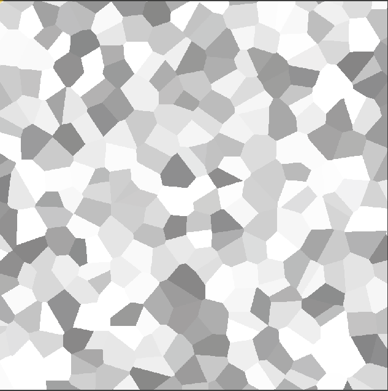|
|Eucledean                      |Distance                   |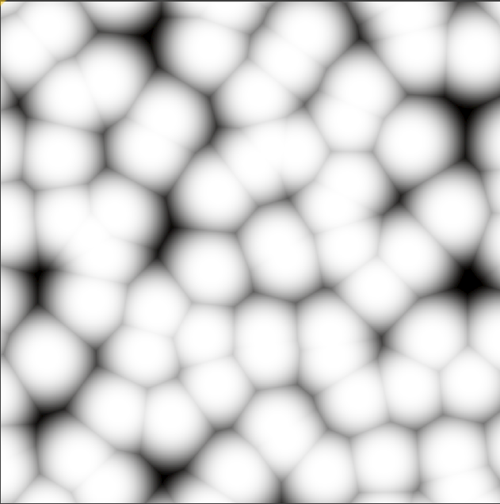|
|Eucledean                      |Distance 2                 |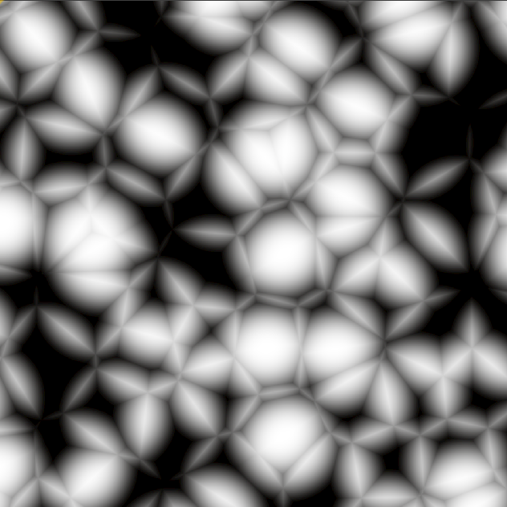|
|Eucledean                      |Distance 2Add              |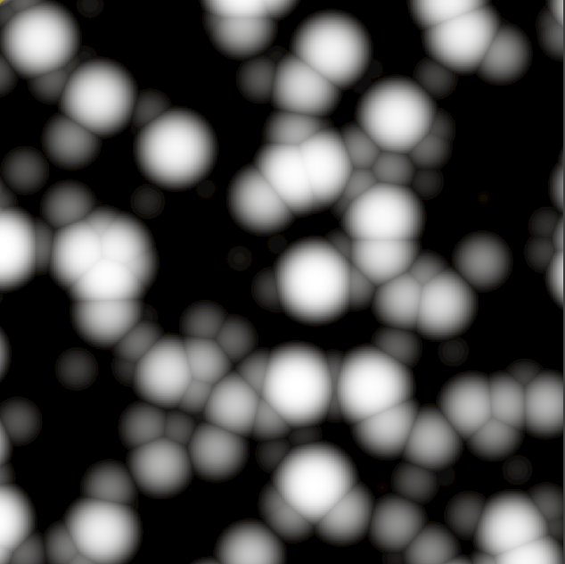|
|Eucledean                      |Distance 2Sub              |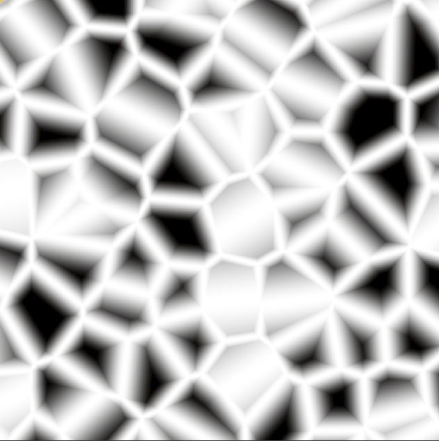|
|Eucledean                      |Distance 2Mul              |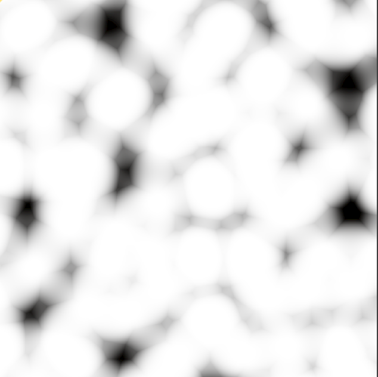|
|Eucledean                      |Distance 2Div              |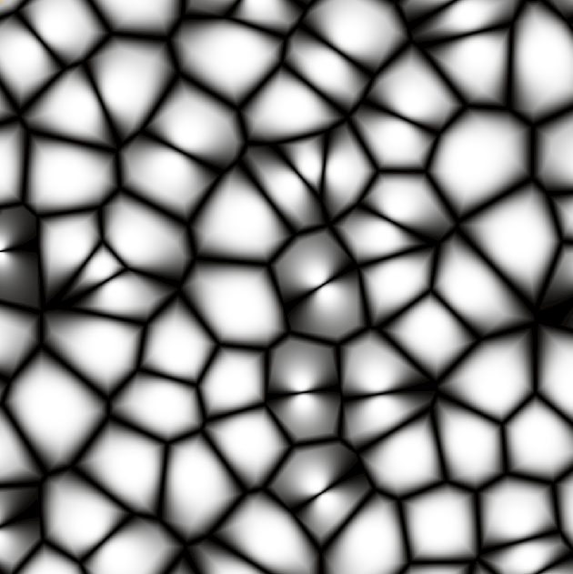|
|Manathan                       |Cell Value                 |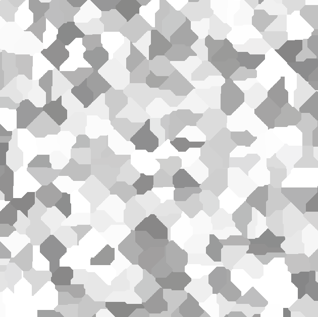|
|Manathan                       |Distance                   ||
|Manathan                       |Distance 2                 |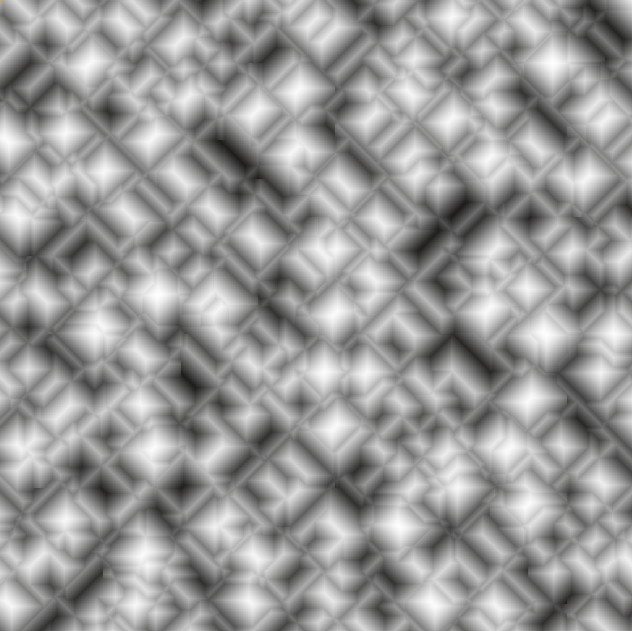|
|Manathan                       |Distance 2Add              |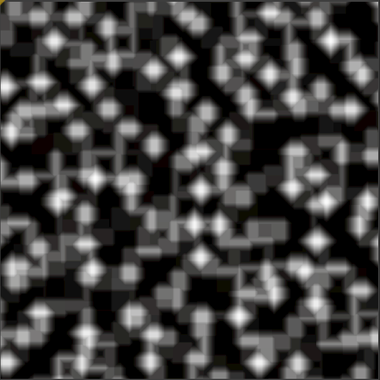|
|Manathan                       |Distance 2Sub              |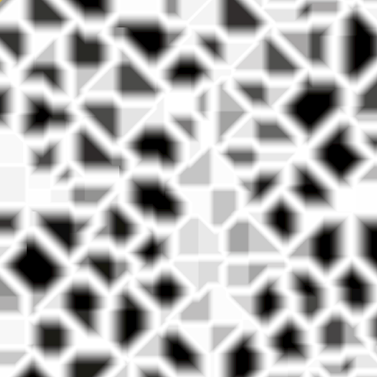|
|Manathan                       |Distance 2Mul              |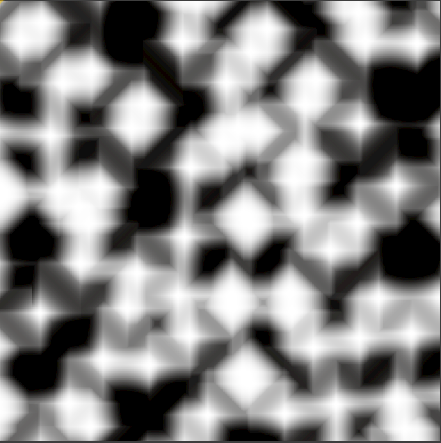|
|Manathan                       |Distance 2Div              |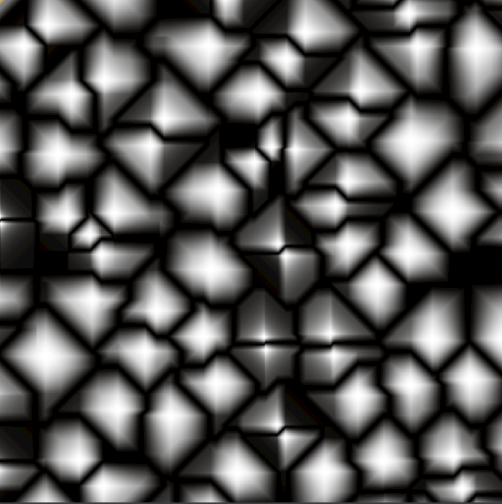|
|Natural                        |Cell Value                 |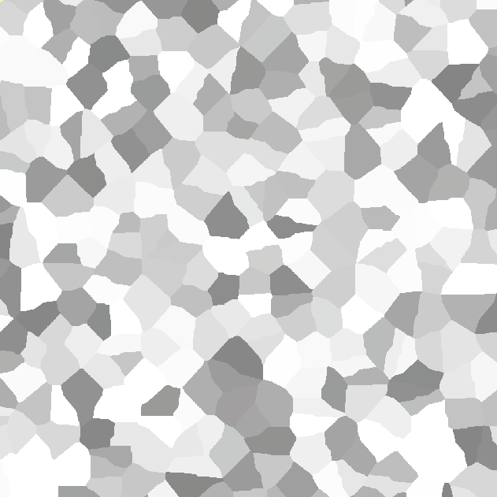|
|Natural                        |Distance                   |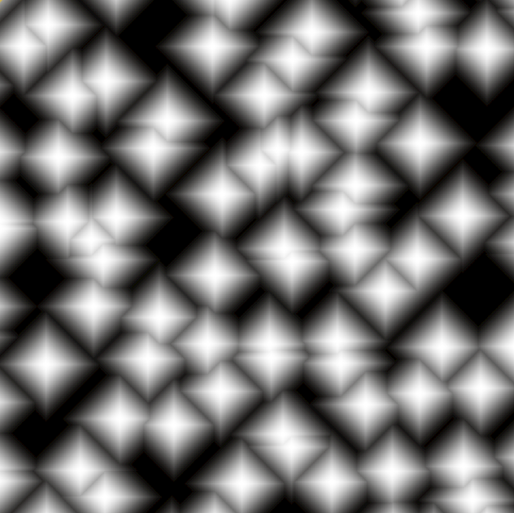|
|Natural                        |Distance 2                 |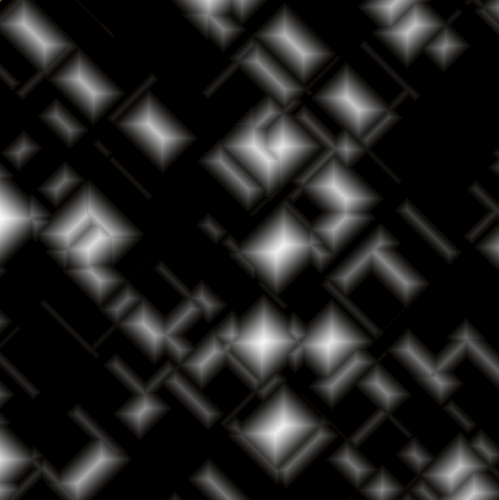|
|Natural                        |Distance 2Add              ||
|Natural                        |Distance 2Sub              |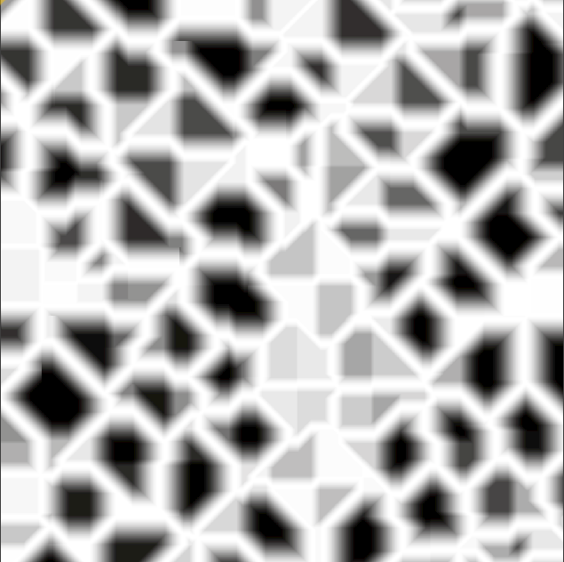|
|Natural                        |Distance 2Mul              |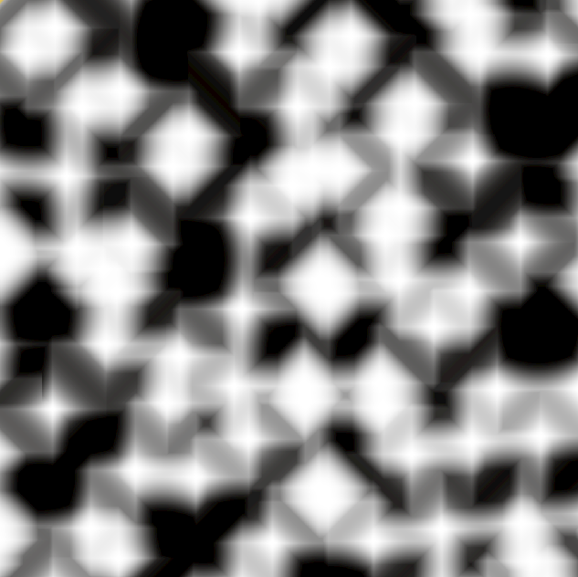|
|Natural                        |Distance 2Div              |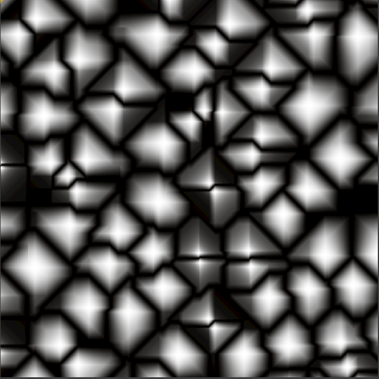|

## 2D Crater Noise
Setup:

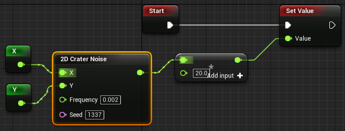

> Not All Picture Has The Same Zoom Factor

| Output                                        |
| --------------------------------------------- |
||

## 2D Crater Noise Fractal
Setup:

> Not All Picture Has The Same Zoom Factor

| Output                                        |
| --------------------------------------------- |
||

## 2D Cubic Noise
Setup:

> In the node, there's a setting for Interpolation but it doesn't seem to do anything

> Not All Picture Has The Same Zoom Factor

| Output                                        |
| --------------------------------------------- |
||

## 2D Cubic Noise Fractal
Setup:

> Not All Picture Has The Same Zoom Factor

|Fractal Type| Output                                        |
| ---------- | --------------------------------------------- |
| FBM        ||
| Billow     ||
| Rigid Multi||

## 2D Gavoronoi Noise
Setup:

> In the node, there's a setting for Interpolation but it doesn't seem to do anything

> Not All Picture Has The Same Zoom Factor

| Output                                        |
| --------------------------------------------- |
||

## 2D Gavoronoi Noise Fractal
Setup:

> In the node, there's a setting for Interpolation but it doesn't seem to do anything

> Not All Picture Has The Same Zoom Factor

| Output                                        |
| --------------------------------------------- |
||

## 2D IQ Noise
Setup:

> In the node, there's a setting for Interpolation but it doesn't seem to do anything

> Not All Picture Has The Same Zoom Factor

| Output                                        |
| --------------------------------------------- |
||

## 2D Perlin Noise
Setup:

> In the node, there's a setting for Interpolation but it has minimal impact on the generation

> Not All Picture Has The Same Zoom Factor

| Output                                        |
| --------------------------------------------- |
||

## 2D Perlin Noise Fractal
Setup:

> In the node, there's a setting for Interpolation but it has minimal impact on the generation

> Not All Picture Has The Same Zoom Factor

| Output                                        |
| --------------------------------------------- |
||

## 2D Simplex Noise
Setup:

> In the node, there's a setting for Interpolation but it has minimal impact on the generation

> Not All Picture Has The Same Zoom Factor

| Output                                        |
| --------------------------------------------- |
||

## 2D Simplex Noise Fractal
Setup:

> In the node, there's a setting for Interpolation but it has minimal impact on the generation

> Not All Picture Has The Same Zoom Factor

| Output                                        |
| --------------------------------------------- |
||

## 2D Value Noise
Setup:

> In the node, there's a setting for Interpolation but it has minimal impact on the generation

> Not All Picture Has The Same Zoom Factor

| Output                                        |
| --------------------------------------------- |
||

## 2D Value Noise Fractal
Setup:

> In the node, there's a setting for Interpolation but it has minimal impact on the generation

> Not All Picture Has The Same Zoom Factor

| Output                                        |
| --------------------------------------------- |
||