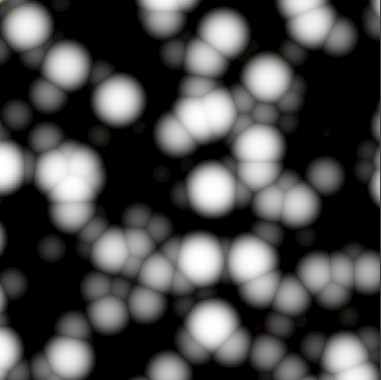
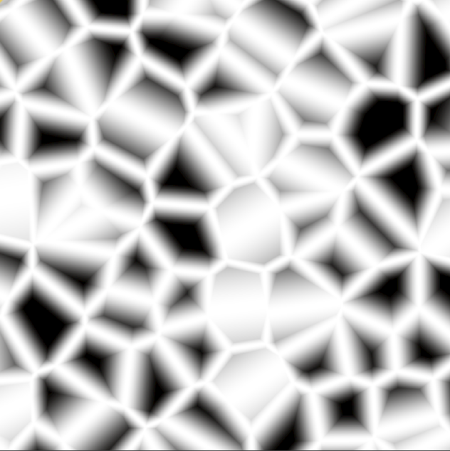
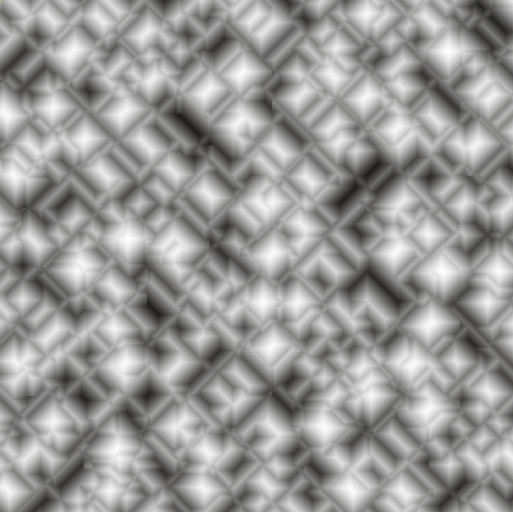
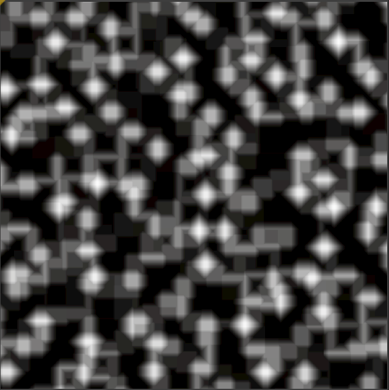
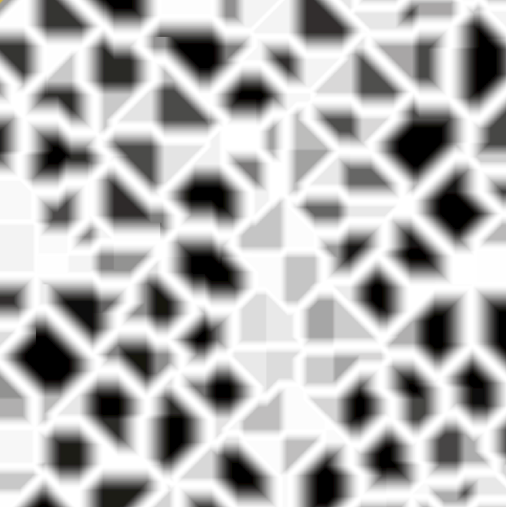
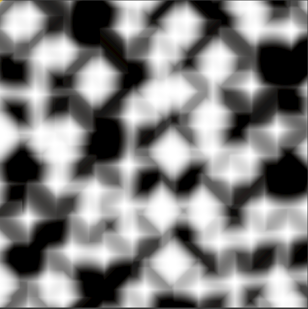
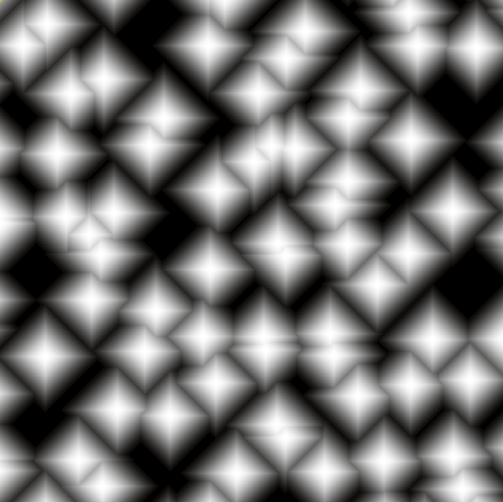
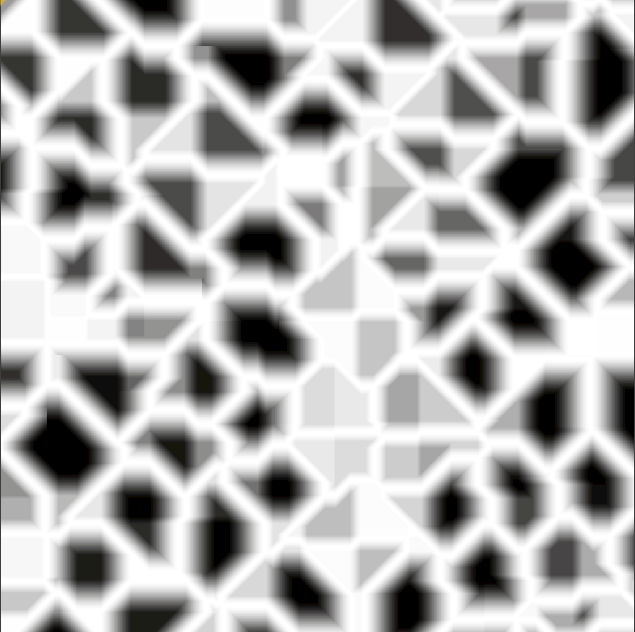

# Voxel Pro Noise

## 2D Cellular Noise

Setup:

> Not All Picture Has The Same Zoom Factor

| Node setting Dist Func        | Node setting Return type  | Output                                        |
| ----------------------------- | ------------------------- | --------------------------------------------- |
|Eucledean                      |Cell Value                 ||
|Eucledean                      |Distance                   ||
|Eucledean                      |Distance 2                 ||
|Eucledean                      |Distance 2Add              ||
|Eucledean                      |Distance 2Sub              ||
|Eucledean                      |Distance 2Mul              ||
|Eucledean                      |Distance 2Div              ||
|Manathan                       |Cell Value                 ||
|Manathan                       |Distance                   ||
|Manathan                       |Distance 2                 ||
|Manathan                       |Distance 2Add              ||
|Manathan                       |Distance 2Sub              ||
|Manathan                       |Distance 2Mul              ||
|Manathan                       |Distance 2Div              ||
|Natural                        |Cell Value                 ||
|Natural                        |Distance                   ||
|Natural                        |Distance 2                 ||
|Natural                        |Distance 2Add              ||
|Natural                        |Distance 2Sub              ||
|Natural                        |Distance 2Mul              ||
|Natural                        |Distance 2Div              ||