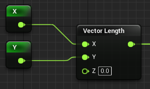
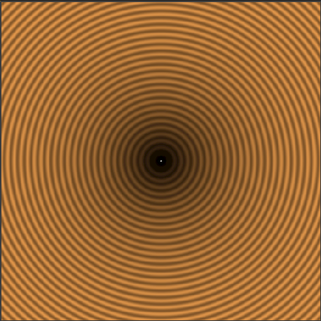
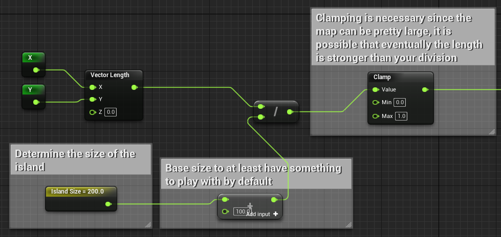
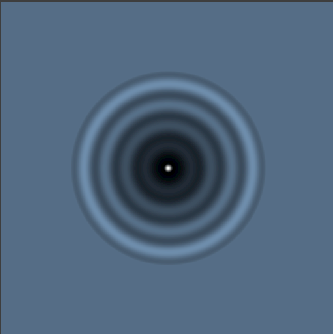
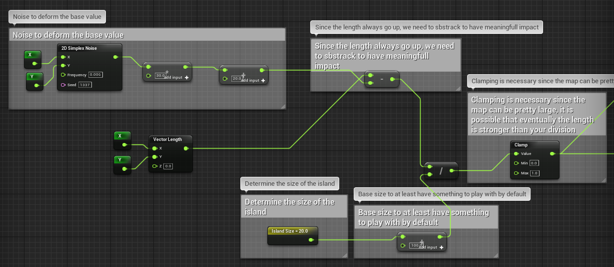
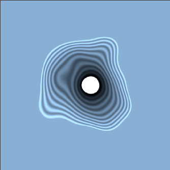
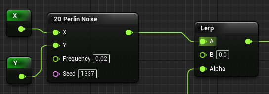
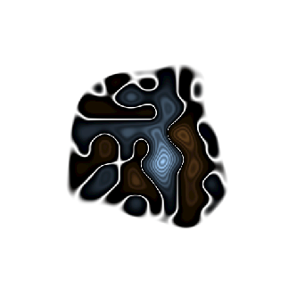

# Generation Tips And Trick

## Single Island/Continent
Source: [Voxel Plugin Discord](https://discord.com/channels/379297529235243020/607761275333902338/806846988502171699)
### Focal point
You can use the vector length to determine the center location of the map

|Setup|Output|
|-----|------|
|||

### Control the size
This is however not useable since the length that is returned is larger than 1. If you were to generate with just this, you would get a spike from the center that goes up to infinity.
In order to make it useable, we need to device the return value until it's whithin range of useafull generation.

|Setup|Output|
|-----|------|
|||

### Deform
Since the previous steps create a perfect circle, we can add some noise to deform the circle

|Setup|Output|
|-----|------|
|||

### Populate the Island
You can then use this information to populat the island data with a simple lerp float.

|Setup|Output|
|-----|------|
|||

> NOTE: This current setup will have plains at sea level where it should be ocean. The B value of the lerp can be change to a value bolow 0 to at least be under the sea level if need be.